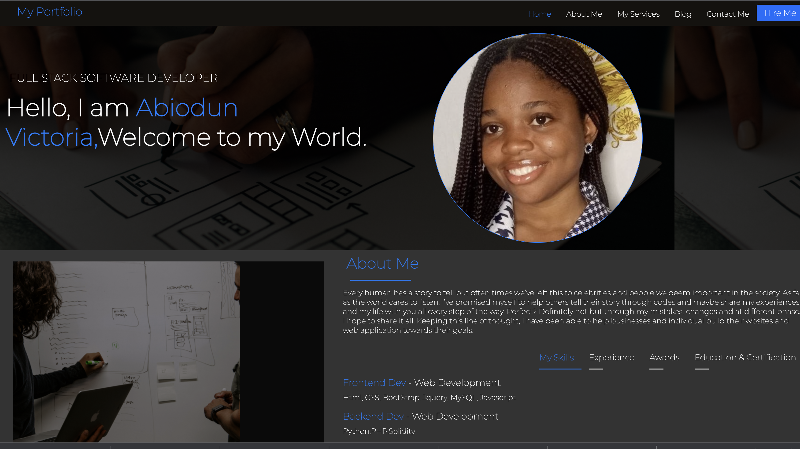

# my-week3-portfolio-demo

This project was one of the first full website I worked on when starting my software development journey. It is a responsive full-stack developer portfolio demo.

At first, I wasn't sure if I should share it as it's an old work and I can do so much more than this now. However I had a change of mind because it shows my growth and process and I blie ve may also be useful to others.

#Languages used.

I used HTML, CSS,and Bootstrap.

#Project's Snippet

